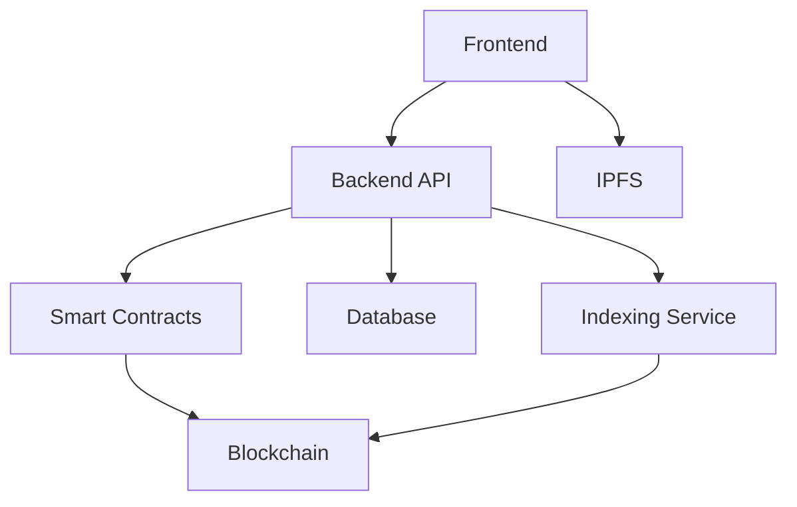

# System Architecture

This document describes the high-level architecture of the REChain platform.

## Overview

The system consists of the following main components:

1. **Frontend**: Web-based user interface (React/Angular/Vue)
2. **Backend API**: REST/GraphQL API server (Node.js/Python)
3. **Smart Contracts**: Blockchain components (Solidity/Rust)
4. **Database**: Persistent storage (PostgreSQL/MongoDB)
5. **Indexing Service**: Blockchain event indexer (The Graph)
6. **IPFS**: Decentralized file storage

## Component Details

### Frontend
- Built with modern framework (React, Angular, or Vue)
- Implements Web3 integration (web3.js/ethers.js)
- Communicates with backend API and directly with blockchain

### Backend API
- Handles business logic not suitable for on-chain execution
- Interfaces with database and external services
- Provides authentication and authorization

### Smart Contracts
- Implement core business logic on blockchain
- Handle tokenization of real estate assets
- Manage ownership transfers and payments

### Database
- Stores user profiles
- Manages session data
- Caches blockchain data for faster access

### Indexing Service
- Indexes blockchain events for efficient querying
- Provides GraphQL API for complex queries

### IPFS
- Stores property documents
- Hosts property images/videos
- Provides content-addressable storage

## Web3/Web4/Web5 Integration
- **Web3**: Blockchain integration for transactions and ownership
- **Web4**: AI integration for property valuation and recommendations
- **Web5**: Decentralized identity and data storage
