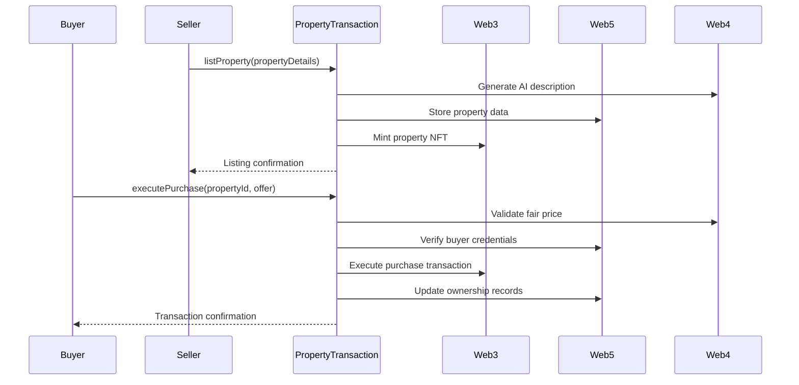

# REChain Property Transaction Module

## Overview
This module integrates Web3 (blockchain), Web5 (decentralized identity/data), and Web4 (AI) to enable end-to-end real estate transactions:



## Key Features

### 1. AI-Enhanced Property Listing
```javascript
const transaction = new PropertyTransaction(
  'https://mainnet.infura.io/v3/YOUR_KEY',
  { /* Web5 config */ },
  'sk-your-openai-key'
);

const listing = await transaction.listProperty({
  address: '123 Blockchain Ave',
  size: '2000 sqft',
  price: 500000,
  features: ['Smart Home', 'Solar']
}, sellerDID);
```

### 2. Intelligent Purchase Execution
```javascript
const purchase = await transaction.executePurchase(
  buyerDID,
  listing.web5RecordId,
  490000 // Offer amount
);
```

### 3. Ownership Verification
```javascript
const verification = await transaction.verifyOwnership(
  listing.web5RecordId,
  buyerDID
);

console.log(verification.verified); // true
```

## Transaction Flow
1. **Listing Creation**
   - AI generates compelling description
   - Property data stored on DWN
   - NFT minted on Ethereum

2. **Purchase Execution**
   - AI validates offer against market data
   - Buyer credentials verified
   - Smart contract executes transfer
   - Ownership records updated

3. **Post-Transaction**
   - Automated title transfer
   - Permanent ownership record on blockchain
   - Verifiable credentials issued

## Security Features
- **Zero-Knowledge Proofs**: Buyer financial verification without exposing sensitive data
- **Multi-Signature Escrow**: 2-of-3 signer requirement for funds release
- **Immutable Audit Trail**: All steps recorded on REChain and Ethereum
